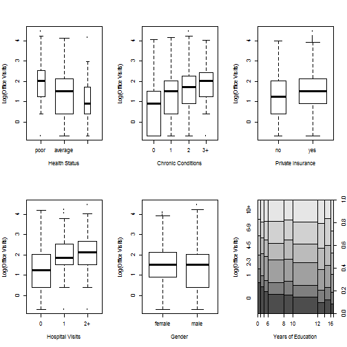

## Introduction

The purpose of this application is to estimate the number of healthcare related office visits by individuals aged 66 and older based on some health-related variables as well as socioeconomic variables.

This application implements a predictive model presented by Achim Zeileis, 
Christian Kleiber and Simon Jackman in "Regression Models for Count Data in R", Journal of Statistical Software, 2006. The model is based on data obtained from the US National Medical Expenditure Survey (NMES) for 1987/88 and describing 4406 individuals covered by Medicare. 

--- .class #id 

## Variables

### Health-related Variables
- Number of hospital stays (from 0 up to 10)
- Self-perceived health status (excellent, average, poor)
- Number of chronic conditions (from 0 up to 8)

### Socioeconomic Variables
- Gender (Female / Male)
- Number of years of education (from 0 up to 18)
- Private insurance indicator (whether the patient has private insurance).

--- .class #id 

## Data Visualization

 

--- .class #id 

## Results

The values for the Estimated Number of Office Visits ranges from 4.8 down to 0.55 for the most demanding and the least demanding patients respectivelly.

The selected algorithm is based on Poisson regression and gives results in the interval:

* [4.7, 4.9] for the most demanding patients
* [0.49, 0.62] for the least demanding patients

All of these values were predicted with 95% confidence.

